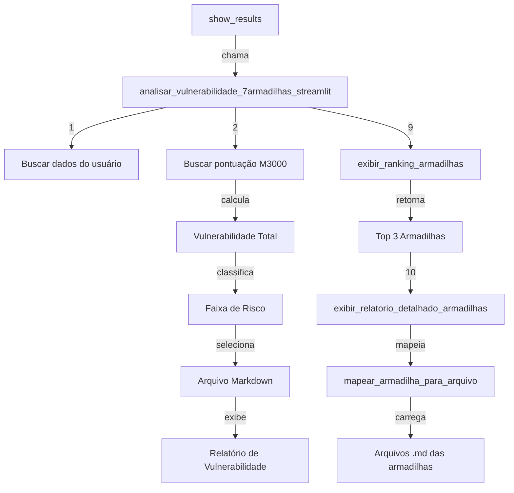
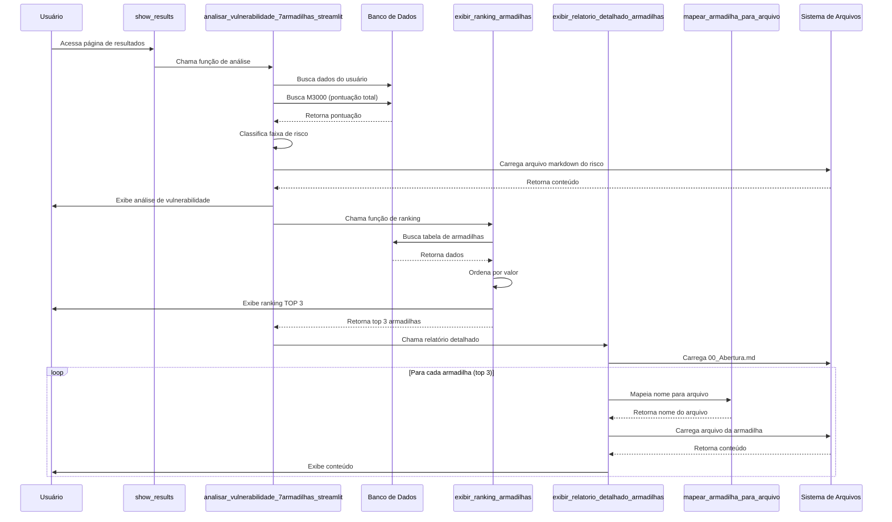

# Análise da Lógica do Bloco de Análise de Vulnerabilidade e Relatórios

## Visão Geral do Sistema

O sistema de análise de vulnerabilidade avalia o perfil do empresário através de 7 armadilhas, calcula uma pontuação total, classifica o nível de risco e gera relatórios personalizados baseados nos resultados.

## Fluxo Principal de Dados




## Componentes Principais

### 1. Função Principal: `analisar_vulnerabilidade_7armadilhas_streamlit`

**Localização:** [paginas/resultados_04.py](paginas/resultados_04.py) (linhas 2320-2453)**Responsabilidades:**

- Buscar dados do usuário (nome, email, empresa)
- Buscar pontuação total (M3000) do banco de dados
- Calcular vulnerabilidade total
- Classificar faixa de risco
- Selecionar arquivo markdown apropriado
- Exibir interface Streamlit com resultados

**Lógica de Classificação de Risco:**

```python
if vulnerabilidade_total <= 14:
    faixa_risco = "Baixo Risco"
    arquivo_markdown = "1_BaixoRisco.md"
elif vulnerabilidade_total <= 24:
    faixa_risco = "Atenção"
    arquivo_markdown = "2_Atencao.md"
elif vulnerabilidade_total <= 33:
    faixa_risco = "Alto Risco"
    arquivo_markdown = "3_AltoRisco.md"
else:
    faixa_risco = "Crítico"
    arquivo_markdown = "4_RiscoCritico.md"
```

**Pontos de Atenção:**

- A pontuação M3000 é um valor pré-calculado armazenado no banco (não calculado nesta função)
- A vulnerabilidade total é simplesmente igual à pontuacao M3000 (sem cálculos adicionais)
- Há validação para verificar se os dados existem antes de processar

### 2. Sistema de Pontuação (M3000)

**Fonte de Dados:**

- Tabela: `forms_resultados_04`
- Campo: `str_element = 'M3000'`
- Valor: `value_element` (numérico, 0-42 pontos)

**Observações:**

- O valor M3000 parece ser calculado em outro lugar do sistema (provavelmente durante o preenchimento do formulário)
- Este valor representa a soma total das respostas das 7 armadilhas
- Escala: 0 a 42 pontos (6 pontos por armadilha, assumindo 7 armadilhas)

### 3. Função de Ranking: `exibir_ranking_armadilhas`

**Localização:** [paginas/resultados_04.py](paginas/resultados_04.py) (linhas 1777-1952)**Lógica:**

1. Busca a primeira tabela do tipo 'tabela' no banco
2. Extrai `select_element` (type_names) e `str_element` (rótulos)
3. Para cada type_name, busca o valor correspondente
4. Cria DataFrame e ordena por valor numérico (decrescente)
5. Exibe tabela HTML estilizada
6. Retorna as 3 primeiras armadilhas do ranking

**Estrutura de Dados:**

- `select_element`: Lista de type_names separados por `|` (ex: "M1001|M1002|M1003")
- `str_element`: Lista de rótulos separados por `|` (ex: "Armadilha 1|Armadilha 2|Armadilha 3")
- Cada type_name corresponde a uma armadilha específica

**Retorno:**

- Lista com nomes das 3 primeiras armadilhas (ex: ["Sobrecarga e Solidão", "Vida Pessoal x Profissional", "Sem Backup"])

### 4. Função de Mapeamento: `mapear_armadilha_para_arquivo`

**Localização:** [paginas/resultados_04.py](paginas/resultados_04.py) (linhas 2217-2257)**Lógica:**

- Normaliza o nome da armadilha (minúsculas, sem acentos)
- Busca correspondência por palavra-chave em dicionário de mapeamento
- Retorna nome do arquivo .md correspondente

**Mapeamento:**

```python
{
    'sobrecarga': '01_Sobrecarga_Solidao.md',
    'pessoal': '02_Pessoal_Profissional.md',
    'backup': '03_Backup_Sucessao.md',
    'crescimento': '04_Crescimento_Improviso.md',
    'dependência': '05_Dependencia_Dono.md',
    'dificuldade': '06_Dificuldade_parceiros.md',
    'tempo': '07_Falta_Tempo.md'
}
```

**Limitações:**

- Depende de palavras-chave específicas no nome da armadilha
- Pode falhar se o nome não contiver palavras-chave conhecidas
- Retorna `None` se não encontrar correspondência

### 5. Função de Relatório Detalhado: `exibir_relatorio_detalhado_armadilhas`

**Localização:** [paginas/resultados_04.py](paginas/resultados_04.py) (linhas 2259-2318)**Lógica:**

1. Recebe lista das top 3 armadilhas
2. Carrega arquivo `00_Abertura.md` (introdução)
3. Para cada armadilha:

- Mapeia nome para arquivo .md
- Carrega e exibe conteúdo do arquivo

4. Exibe tudo na interface Streamlit

**Estrutura de Arquivos:**

- `Conteudo/04/00_Abertura.md` - Introdução geral
- `Conteudo/04/01_Sobrecarga_Solidao.md` - Detalhes da armadilha 1
- `Conteudo/04/02_Pessoal_Profissional.md` - Detalhes da armadilha 2
- ... (até 07_Falta_Tempo.md)

### 6. Geração de PDF: `generate_pdf_content`

**Localização:** [paginas/resultados_04.py](paginas/resultados_04.py) (linhas 928-1437)**Estrutura do PDF:**

1. Informações do Usuário (topo)
2. Título Principal
3. Gráfico Perfil (com legenda)
4. Análise Detalhada (baseada em M3000)
5. Ranking das Armadilhas (TOP 3)
6. Relatório Detalhado das Armadilhas

**Funções Auxiliares para PDF:**

- `obter_dados_ranking_pdf`: Obtém dados do ranking para PDF
- `obter_top_3_armadilhas_pdf`: Obtém nomes das top 3 armadilhas
- `processar_e_adicionar_markdown_pdf`: Processa markdown para formato PDF

## Pontos Críticos e Possíveis Problemas

### 1. Dependência do M3000

- **Problema:** O valor M3000 precisa estar pré-calculado no banco
- **Risco:** Se M3000 não existir ou estiver incorreto, toda a análise falha
- **Validação:** Existe verificação, mas apenas retorna mensagem de erro

### 2. Mapeamento de Armadilhas

- **Problema:** Depende de palavras-chave fixas
- **Risco:** Se o nome da armadilha mudar no banco, o mapeamento pode falhar
- **Solução Atual:** Retorna `None` e exibe warning

### 3. Duplicação de Código

- **Problema:** Lógica similar em `analisar_vulnerabilidade_7armadilhas_streamlit` e `analisar_vulnerabilidade_7armadilhas`
- **Observação:** A segunda função parece ser versão antiga ou para uso em outros contextos

### 4. Numeração de Comentários

- **Problema:** Comentários numerados não estão em sequência correta (ex: dois "# 3.")
- **Impacto:** Baixo, mas pode confundir manutenção

### 5. Tratamento de Erros

- **Pontos Positivos:** Try/except em todas as funções principais
- **Melhorias Possíveis:** Logs mais detalhados, fallbacks mais robustos

## Fluxo de Execução Completo




## Recomendações de Melhoria

1. **Centralizar Lógica de Classificação:** Criar função única para classificar risco
2. **Melhorar Mapeamento:** Usar IDs únicos em vez de palavras-chave
3. **Validação Robusta:** Verificar existência de todos os arquivos antes de processar
4. **Cache de Dados:** Evitar múltiplas consultas ao banco para os mesmos dados
5. **Logging:** Adicionar logs estruturados para debugging
6. **Testes Unitários:** Criar testes para cada função crítica